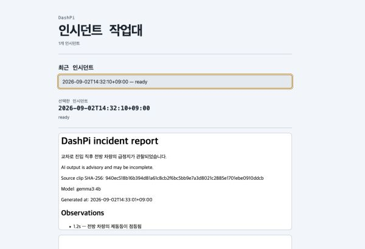
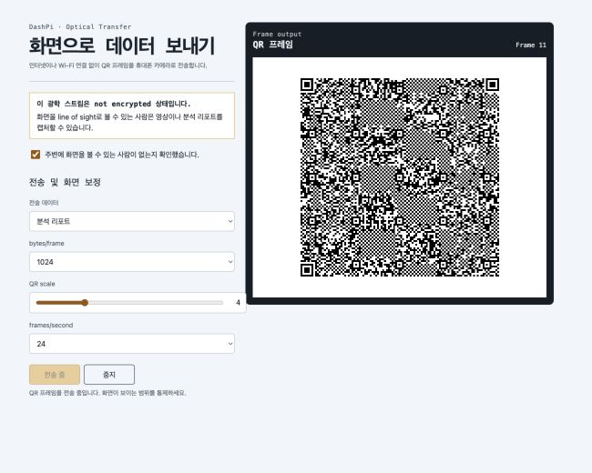
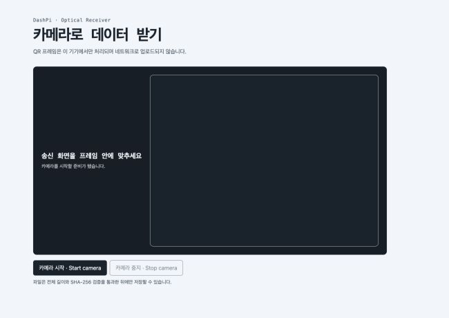
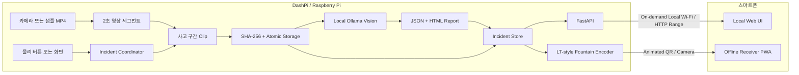
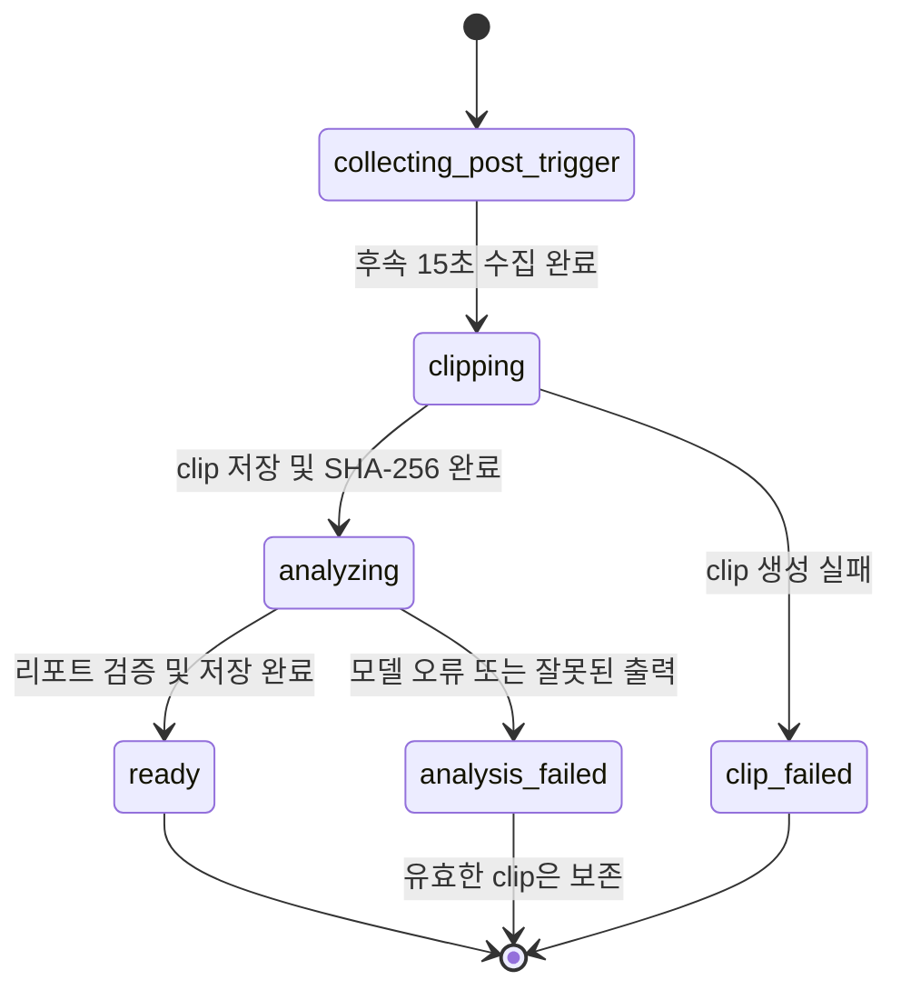

<div align="center">
  
  <h1>DashPi</h1>
  <p><strong>인터넷 없이 사고 영상을 보존하고, 로컬 AI로 분석하는 스마트 대시캠</strong></p>
  <p>School Capstone Project · Offline-first · Evidence-first</p>
  <p>
    
    
    
    
  </p>
</div>

> **현재 단계:** 데스크톱에서 전체 사고 처리·전송 흐름을 검증한 MVP 소프트웨어 프로토타입입니다. Raspberry Pi 카메라, 물리 버튼, 디스플레이 및 핫스팟 제어는 하드웨어 통합·수락 시험 단계로 구분합니다.

## 프로젝트 소개

사고 증거가 가장 필요한 순간에 인터넷 연결이나 외부 서버를 신뢰할 수 없다면 어떻게 해야 할까요?

DashPi는 사고 영상을 먼저 안전하게 보존하고, Raspberry Pi에서 실행되는 vision-capable Ollama 모델로 영상을 분석합니다. 사용자는 계정이나 네이티브 앱 없이 결과를 확인하고 다음 두 경로 중 하나로 가져갈 수 있습니다.

- **Local Wi-Fi:** 영상처럼 큰 파일을 HTTP Range 기반으로 재생·이어받기
- **Optical QR:** 네트워크 없이 최대 16 MiB 파일을 애니메이션 QR로 전송

주 사용자는 연결이 불안정하거나 클라우드 업로드를 원하지 않는 운전자입니다. 핵심 가치는 다음 한 문장으로 요약됩니다.

> **Understand and preserve an accident without depending on the cloud.**

## 왜 DashPi인가

| 설계 원칙 | 적용 방식 |
| --- | --- |
| Offline-first | 녹화 처리, clip 생성, AI 분석, 결과 조회가 외부 클라우드 없이 동작합니다. |
| Evidence-first | AI 분석 실패가 유효한 사고 영상을 삭제하거나 무효화하지 않습니다. |
| Dual transfer | 대용량은 Local Wi-Fi, 소용량은 Animated QR로 전송합니다. |
| Verifiable | 결과 저장과 전송 완료 여부를 SHA-256으로 검증합니다. |
| Hardware-aware | QR 크기·FPS·block size 등 물리 환경에 민감한 값을 보정할 수 있습니다. |

## 동작 화면

아래 이미지는 목업이 아니라 현재 FastAPI 애플리케이션과 임시 incident 데이터로 직접 캡처한 화면입니다.

| 사고 영상·리포트 조회 | Animated QR 송신 | Offline PWA 수신 |
| --- | --- | --- |
|  |  |  |

## 시스템 아키텍처

DashPi는 마이크로서비스 묶음이 아니라 Raspberry Pi에서 실행되는 하나의 로컬 Python 애플리케이션입니다. 스마트폰에는 Local Wi-Fi용 브라우저 화면과 사전 설치 가능한 Optical Receiver PWA만 존재합니다.



## 사고 처리 흐름

기본 사고 구간은 trigger 전 30초부터 trigger 후 15초까지입니다. Clip 생성 실패와 AI 분석 실패를 분리하여, 분석기 장애가 이미 확보한 증거에 영향을 주지 않게 했습니다.



1. 짧은 영상 세그먼트를 계속 생성합니다.
2. 사고 trigger가 들어오면 앞·뒤 구간과 겹치는 세그먼트를 선택합니다.
3. `clip.mp4.partial`을 완성하고 flush·hash 후 원자적으로 이름을 바꿉니다.
4. 12개 프레임과 clip 기준 timestamp를 로컬 Ollama에 전달해 사고 시점을 찾습니다.
5. 사고 시점 앞뒤 5초를 10초 파생 영상으로 만들고, 선택한 항목만 detection·tracking overlay로 표시합니다.
6. 검증된 JSON과 자급형 HTML 리포트를 저장한 뒤 Local Wi-Fi 또는 Optical QR 전송 방식을 제공합니다.

## 두 가지 전송 방식

| | Local Wi-Fi | Optical QR |
| --- | --- | --- |
| 적합한 데이터 | 전체 사고 영상, 리포트 | 리포트와 16 MiB 이하 파일 |
| 연결 | 필요할 때만 켜는 로컬 핫스팟 | 화면과 카메라의 line-of-sight |
| 전송 | FastAPI + HTTP Range | Animated QR + LT-style fountain symbols |
| 손실 대응 | Range 재요청·이어받기 | 순서가 바뀌거나 일부 유실된 frame 복원 |
| 완료 조건 | 저장된 digest와 파일 검증 | 전체 길이 및 SHA-256 일치 |
| 기밀성 | WPA2 핫스팟 운영을 전제로 설계 | **암호화되지 않음** — 주변 카메라가 캡처 가능 |

Optical QR은 일반 카메라 앱만으로 복원할 수 없으므로, 수신 PWA를 온라인 환경에서 미리 설치해야 합니다. PWA shell은 오프라인 캐시되며 검증을 통과한 파일만 저장 버튼을 노출합니다.

## 구현 현황

### 구현 및 자동 검증 완료

- 샘플 MP4 기반 세그먼트 생성, 사고 구간 선택 및 clip 생성
- 로컬 Ollama model 확인·분석 요청·출력 schema 검증
- clip 기준 timestamp를 이용한 사고 시점 localization과 앞뒤 5초 annotated video 생성
- 신호등·차선·표지판 독립 overlay 설정, object tracking 및 tracking 실패 fallback
- 영상·핵심 장면·통계가 포함된 자급형 HTML 리포트와 브라우저 PDF 저장
- 비동기 리포트 재생성, 진행 상태 polling 및 16 MiB Optical 크기 fallback
- `.partial` → flush → SHA-256 → atomic rename 저장 순서
- AI 실패 시 `analysis_failed` 상태와 clip 보존
- incident 목록, 리포트 조회, ranged video 응답을 제공하는 FastAPI
- 독립적으로 정의한 DashPi Optical v1 frame·container protocol
- Python sender와 TypeScript receiver 간 golden vector 호환
- 중복·순서 변경·결정적 15% frame loss가 포함된 1 MiB 복구 시나리오
- 설치 가능한 offline optical receiver PWA

### Raspberry Pi 하드웨어 수락 시험 필요

- Picamera2 장시간 녹화 안정성 및 timestamp 정확도
- 물리 trigger wiring·debounce와 로컬 디스플레이 통합
- WPA2 hotspot 시작·종료 및 captive portal 동작
- 실제 화면 밝기·QR scale·FPS·휴대폰 decode rate 보정
- Ollama latency, 메모리, 발열 및 전력 측정
- 갑작스러운 전원 차단 이후 저장소 복구

### MVP 범위 밖

- 클라우드 업로드·클라우드 AI·원격 계정
- iOS·Android 네이티브 앱
- 자동 충돌 감지 및 Bluetooth trigger
- Optical QR 암호화·pairing
- 사고 과실에 대한 법적 판단

## 빠른 시작

### 요구사항

- Python 3.11 이상
- FFmpeg와 ffprobe
- [Ollama](https://ollama.com/) 및 vision-capable model
- Node.js — 웹 소스를 수정하거나 테스트할 때만 필요하며 현재 검증 환경은 v22입니다.

macOS에서는 다음 명령으로 시스템 도구를 준비할 수 있습니다.

```bash
brew install ffmpeg ollama
```

### 설치

```bash
git clone https://github.com/jcmaker/DashPi.git
cd DashPi
python3 -m venv .venv
source .venv/bin/activate
python -m pip install --upgrade pip
python -m pip install -e ".[dev]"
```

### 사고 처리 시뮬레이션

먼저 45초 이상의 테스트 영상을 저장소 루트에 `input.mp4`라는 이름으로 준비합니다. 다음 예시는 30초 지점을 trigger로 사용하여 기본 `30초 전 + 15초 후` 구간을 처리합니다.

```bash
ollama pull qwen2.5vl:3b
dashpi simulate input.mp4 \
  --trigger-seconds 30 \
  --data-root ./demo-data \
  --ollama-model qwen2.5vl:3b
```

성공하면 incident metadata가 JSON으로 출력되고 다음 결과가 `demo-data/incidents/<incident_id>/`에 생성됩니다.

- `clip.mp4` — trigger 전 30초와 후 15초를 보존한 원본 증거 영상이며, overlay를 적용하지 않습니다.
- `annotated.mp4` — 사고 시점 전후 5초를 담은 10초 전송용 파생 영상입니다.
- `report.json`
- `report.html` — `annotated.mp4`와 before·incident·after 핵심 장면 3장을 data URL로 포함한 자급형 오프라인 리포트입니다.
- `metadata.json`

선택 overlay는 기본적으로 모두 OFF입니다. YOLOv8 COCO ONNX detector와 함께 필요할 때만 다음 flags를 사용합니다.

```bash
dashpi simulate input.mp4 \
  --trigger-seconds 30 \
  --data-root ./demo-data \
  --ollama-model qwen2.5vl:3b \
  --detector-model yolov8n.onnx \
  --show-traffic-lights --show-lanes --show-traffic-signs
```

Detector는 YOLOv8 COCO ONNX의 `[1,84,8400]` 또는 `[1,8400,84]` output 형식만 지원합니다.

## 사고 리포트와 전송

`report.html`의 **Download HTML**은 재생 가능한 10초 annotated video를 포함한 오프라인 단일 파일을 저장합니다. **Save as PDF**는 브라우저의 인쇄 대화상자를 사용해 작성 분석과 핵심 장면 3장을 정적 PDF로 저장하므로, 재생 가능한 영상은 HTML에만 남습니다.

Optical QR 전송은 안전하게 정차한 뒤에 시작합니다. 완성된 `report.html`이 16 MiB를 넘으면 DashPi는 전송용 `annotated.mp4`만 낮은 품질로 다시 인코딩하며 원본 `clip.mp4`는 바꾸지 않습니다. 그래도 16 MiB를 초과하면 Optical QR 대신 Local Wi-Fi를 사용합니다.

### 로컬 UI 실행

```bash
dashpi-server --data-root ./demo-data --host 127.0.0.1 --port 8000
```

- Incident viewer: <http://127.0.0.1:8000/>
- Optical sender: `http://127.0.0.1:8000/sender.html?incident=<incident_id>`
- Optical receiver PWA: <http://127.0.0.1:8000/receiver.html>

> 이 서버는 device-local network용입니다. 공용 인터넷에 직접 노출하는 운영 모드는 MVP에 포함되지 않습니다.

## 테스트와 재현성

### Python

```bash
PYTHONPATH=. python -m pytest -q
```

### TypeScript

```bash
npm ci --prefix web
npm test --prefix web
npm run build --prefix web
```

2026-09-06 기준 병합 결과에서 **Python 306개**, **TypeScript 27개** 테스트를 통과했습니다. 검증 범위에는 다음이 포함됩니다.

- 사고 clip의 pre/post 경계와 중첩 trigger 병합
- AI 실패 후 clip 보존 및 상태 전이
- HTTP Range, ETag, digest 불일치 및 안전한 파일 접근
- Optical frame CRC, container SHA-256 및 크기 제한
- 1 MiB payload의 frame loss·중복·재정렬 복구
- Python ↔ TypeScript golden vector
- 외부 네트워크 연결을 차단한 incident pipeline
- 45초 증거부터 자급형 report까지의 기존 Optical frame loss·중복·재정렬 복구
- wheel 설치 후 packaged local UI smoke test

## 데이터 무결성과 안전 원칙

- 완성 전 파일에는 `.partial` suffix를 사용합니다.
- 파일을 flush한 뒤 SHA-256을 계산하고 최종 이름으로 원자적 교체합니다.
- metadata는 필요한 digest가 기록된 뒤에만 결과를 완료 상태로 표시합니다.
- API는 metadata의 경로·크기·digest와 실제 파일을 다시 대조합니다.
- Optical receiver는 전체 길이와 SHA-256 검증 전 파일을 노출하지 않습니다.
- incident ID와 파일 접근은 path traversal 및 symlink 교체를 방어하도록 제한합니다.

AI 리포트는 화면에 보이는 정황을 정리하는 **보조 자료**입니다. 사각지대, 화질, sampling, model 특성 때문에 불완전할 수 있으며 사고 과실이나 법적 책임을 결정하지 않습니다.

## 저장 구조

실제 장치의 기본 data root는 `/var/lib/dashpi`이며, 개발 시에는 `--data-root`로 별도 경로를 지정할 수 있습니다.

```text
<data-root>/
├── raw/
└── incidents/
    └── <incident_id>/
        ├── clip.mp4
        ├── annotated.mp4
        ├── metadata.json
        ├── report.json
        └── report.html
```

## API 요약

| Method | Endpoint | 역할 |
| --- | --- | --- |
| `GET` | `/api/incidents` | 완료·실패 incident 목록 |
| `GET` | `/api/incidents/{incident_id}` | incident metadata와 JSON report |
| `GET` | `/api/incidents/{incident_id}/report.html` | 사람이 읽는 HTML report |
| `GET` | `/api/incidents/{incident_id}/clip` | Range를 지원하는 사고 영상 |
| `POST` | `/api/incidents/{incident_id}/report` | 수동 사고 시점과 overlay 설정으로 report 재생성 |
| `GET` | `/api/incidents/{incident_id}/report/status` | 비동기 report 재생성 진행·완료·실패 상태 |
| `POST` | `/api/incidents/{incident_id}/optical` | Optical transfer session 생성 |
| `GET` | `/api/optical/{session_id}` | Optical session 정보 |
| `GET` | `/api/optical/{session_id}/frames/{sequence}` | 전송할 binary frame |

## 저장소 구조

```text
DashPi/
├── src/dashpi/           # Python incident pipeline, API, storage, optical sender
│   ├── optical/          # DPQ1/DPC1 protocol과 fountain coding
│   └── web/              # FastAPI가 제공하는 빌드된 web assets
├── web/                  # TypeScript sender/receiver source와 tests
├── tests/                # Python unit, integration, offline, packaging tests
├── scripts/              # deterministic optical fixture 생성 도구
└── docs/                 # PRD, TRD, 설계 및 구현 계획
```

더 자세한 제품·기술 결정은 다음 문서에 있습니다.

- [Product Requirements Document](docs/PRD.md)
- [Technical Requirements Document](docs/TRD.md)
- [Offline Incident and Transfer Design](docs/superpowers/specs/2026-09-02-offline-transfer-design.md)
- [Incident Analysis Report Design](docs/superpowers/specs/2026-09-06-incident-analysis-report-design.md)
- [Agent Handoff Document](docs/AGENT_HANDOFF.md) — AI 코딩 에이전트를 위한 프로젝트 가이드

## 설계 및 문서화 레퍼런스

- [Decimen Optical Transfer](https://github.com/bashalarmistalt/decimen-optical-transfer): Animated QR, LT fountain coding, frame-loss tolerance와 SHA-256 검증을 참고한 화면→카메라 전송 프로젝트. DashPi는 소스나 wire format을 복사하지 않은 독자 규격입니다.
- [GitHub Docs — About READMEs](https://docs.github.com/en/repositories/managing-your-repositorys-settings-and-features/customizing-your-repository/about-readmes): README의 목적·시작 방법·유지보수 정보 구성과 상대 경로 권장사항
- [GitHub Docs — Creating diagrams](https://docs.github.com/en/get-started/writing-on-github/working-with-advanced-formatting/creating-diagrams): GitHub-native Mermaid 작성 방식
- [GitHub Open Source Guides — Starting a Project](https://opensource.guide/starting-a-project/): 처음 방문한 사용자가 목적과 사용법을 이해할 수 있는 공개 프로젝트 문서 구성
- [ANU School of Engineering — Capstone Assessment Guide](https://eng.anu.edu.au/engage/capstone-design-project/information-students/assessment-guide-capstone-project): 문제·stakeholder·가치·성과·prototype evidence와 시각적 일관성 중심의 평가 기준
- [Michael Luby — LT Codes](https://doi.org/10.1109/SFCS.2002.1181950): 손실 환경에서 사용하는 fountain code의 기반 연구

## 라이선스

현재 저장소에는 라이선스가 지정되어 있지 않습니다. 별도 라이선스가 추가되기 전까지 소스 코드의 사용·수정·재배포 권한이 자동으로 부여되지는 않습니다.
