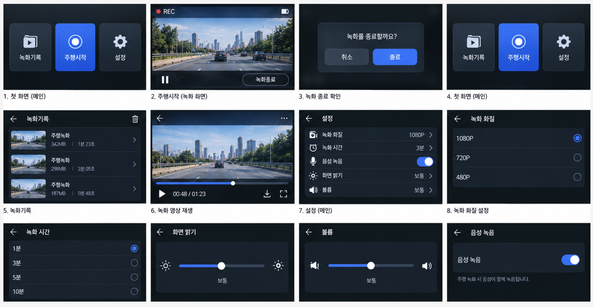

# 🤖 에이전트 핸드오프 문서 (Agent Handoff Document)

> **목적:** 이 문서는 Cursor Cloud Agent, Claude Code, GitHub Copilot, Codex 등 모든 코딩 에이전트가 DashPi 프로젝트를 처음 접근할 때 필요한 핵심 정보를 제공합니다.

---

## 📋 프로젝트 한 줄 요약

**DashPi**는 인터넷 없이 사고 영상을 보존하고 로컬 AI로 분석하는 **오프라인 우선 스마트 대시캠** (학부 캡스톤 프로젝트)입니다.

- **핵심 가치**: 클라우드에 의존하지 않고 사고를 이해하고 증거를 보존합니다.
- **주요 원칙**: Offline-first, Evidence-first, 하드웨어 인지형 설계
- **타깃 환경**: Raspberry Pi 5 + LCD + 카메라 (네이티브 앱 코드는 구현, 실기 수락 시험 대기)

---

## 🎯 의도된 UX 플로우 (Device Target)

다음은 **최종 제품에서 의도된 디바이스 사용자 경험**입니다. 확정된 하드웨어는 Raspberry Pi, LCD, 카메라뿐입니다. 최신 네이티브 앱 설계는 [2026-09-24 설계 문서](superpowers/specs/2026-09-24-native-pi-app-design.md)를 따르며, 아래 기존 와이어프레임과 충돌하면 최신 설계를 우선합니다.

### 디바이스 UI 와이어프레임



위 와이어프레임은 의도된 디바이스 UX의 전체 흐름을 보여줍니다:

### 1️⃣ 메인 화면 (홈)
- **세 가지 주요 버튼**:
  - 🎥 **녹화기록**: 저장된 사고 영상 목록 및 재생
  - ▶️ **주행시작**: 녹화를 시작하고 주행 모드로 진입
  - ⚙️ **설정**: 카메라 해상도·프레임 속도·화질과 로컬 AI 모델

### 2️⃣ 주행 시작 → 녹화 화면
- **주행시작** 버튼 터치 후 실시간 녹화 화면 표시:
  - 🔴 **REC 표시**: 녹화 중임을 시각적으로 표시
  - **사고 분석** 버튼: 사고 시점을 표시하고 녹화를 계속함
  - **종료** 버튼: 녹화 종료. 사고 후 15초 수집 중이면 수집 완료 뒤 자동 종료

### 3️⃣ 사고 발생 시 — Trigger 버튼
- 녹화 중 사고가 발생하면 화면의 **사고 분석** 버튼을 누름. 물리 버튼·휴대폰 트리거는 현재 범위가 아님
- Trigger 전 30초 + 후 15초를 확보한 다음 로컬 분석 시작:
  - 사고 구간 영상 clip 추출
  - SHA-256으로 clip 무결성 보장
  - 로컬 Ollama vision 모델로 사고 시점 분석

### 4️⃣ 분석 완료 후 — 광학(애니메이션 QR) 코드 Display
- 기록 상세에서 **리포트 QR 전송**을 누르면 디바이스 화면에 Animated QR 코드를 표시:
  - Fountain-coded LT 방식으로 최대 16 MiB 파일 전송 가능
  - 프레임 순서 무관, 일부 손실 허용
  - SHA-256 검증 필수
- **사용자 경고**: 광학 전송은 암호화되지 않으므로 주변 카메라가 캡처 가능
- **16 MiB 초과**: Pi 앱은 QR 전송 불가를 알리고 로컬 리포트를 보존함. 핫스팟 자동 전환은 현재 범위 밖

### 5️⃣ 모바일 수신 — 광학 코드 스캔
- 스마트폰의 **Offline Receiver PWA**가 광학 코드 스캔:
  - 카메라로 애니메이션 QR 프레임 캡처
  - 프레임 순서 무관하게 복원
  - SHA-256 검증 후 결과 저장
  - **사고 분석 리포트** (HTML + JSON) 수신 및 열람
  - Annotated 10초 영상 포함 (사고 시점 전후 5초)

### 6️⃣ 설정 화면
- **카메라 해상도**: 1080p / 720p 선택
- **프레임 속도·화질**: 지원 값만 선택
- **로컬 AI 모델**: 설치된 Ollama 모델 지정
- 마이크·GPS·배터리 센서·스피커 관련 설정은 없음

### 7️⃣ 녹화기록 화면
- 저장된 주행·주차 녹화와 완료/실패 사고 목록 표시:
  - 타임스탬프와 상태 (ready/failed)
- 선택 시 **녹화 영상 재생** 및 **리포트 조회**

---

## 💻 현재 구현 상태 (Native App Software — As-Built)

기존 incident·전송 파이프라인에 **Python + PySide6(Qt Widgets) 네이티브 Pi 앱**이 추가되었습니다. `src/dashpi/pi_camera.py`는 Picamera2 단일 카메라에서 Qt 프리뷰와 timestamped MP4 녹화를 함께 제공하도록 작성했고, `src/dashpi/device_session.py`는 수동 트리거·15초 지연 종료·원본 보호를 조정합니다. `src/dashpi/desktop.py`에는 홈·녹화·기록·설정·QR 화면, `src/dashpi/desktop_install.py`에는 바탕화면 아이콘 설치가 있습니다. 데스크톱 가짜 카메라/오프스크린 UI 테스트는 통과했지만 **실제 Pi 5 + LCD + 카메라 검증은 아직 하지 않았습니다**. [설계](superpowers/specs/2026-09-24-native-pi-app-design.md) · [구현 계획](superpowers/plans/2026-09-24-native-pi-app.md) · [설치 안내](../README.md#raspberry-pi-5-네이티브-앱-실기-수락-시험-전)를 우선 읽으세요.

### As-Built Flow (2026-09-24 기준)

#### ✅ 구현 완료
1. **시뮬레이션 기반 incident 생성**:
   ```bash
   dashpi simulate input.mp4 --trigger-seconds 30 --data-root ./demo-data --ollama-model qwen2.5vl:3b
   ```
   - 샘플 MP4 파일에서 세그먼트 생성
   - `--trigger-seconds`로 사고 시점 지정
   - 30초 전 + 15초 후 clip 자동 추출

2. **FastAPI 기반 웹 UI**:
   - `dashpi-server --data-root ./demo-data --host 127.0.0.1 --port 8000`
   - **Incident viewer**: `http://127.0.0.1:8000/` — 저장된 사고 목록 및 리포트 조회
   - **Optical sender**: `http://127.0.0.1:8000/sender.html?incident=<incident_id>` — Animated QR 송신
   - **Optical receiver PWA**: `http://127.0.0.1:8000/receiver.html` — 오프라인 설치 가능한 수신기

3. **로컬 AI 분석 파이프라인**:
   - `src/dashpi/pipeline.py`: incident 상태 전이 및 분석 orchestration
   - `src/dashpi/incidents.py`: incident coordinator, trigger 중복 병합
   - Ollama vision 모델 (qwen2.5vl:3b 등)로 사고 시점 localization
   - JSON + HTML 리포트 생성 (자급형, data URL 포함)
   - YOLOv8 COCO ONNX detector로 신호등/차선/표지판 overlay (선택)

4. **Optical Transfer (광학 전송) 구현**:
   - `src/dashpi/optical/`: DPQ1/DPC1 protocol, LT-style fountain coding
   - `web/`: TypeScript sender/receiver source 및 tests
   - 최대 16 MiB payload, SHA-256 검증, frame loss tolerance
   - Python ↔ TypeScript golden vector 호환 검증 완료

5. **Storage & Integrity**:
   - `.partial` → flush → SHA-256 → atomic rename 패턴
   - Evidence-first: AI 실패 시에도 clip 보존 (`analysis_failed` 상태)
   - HTTP Range 지원, ETag, digest 검증

#### ⚠️ 실제 Pi 하드웨어 수락 시험 대기
- Picamera2/PySide6 API 제공 여부, 동시 프리뷰·녹화 및 timestamp 정확도
- LCD 터치·영상 재생·QR 크기/프레임 속도와 휴대폰 수신률
- Pi 5 소프트웨어 H.264 및 Ollama의 시작 속도·RAM·발열·반응성
- 저장 공간 부족, 카메라 분리, 갑작스러운 전원 차단 후 원본 보존
- GPIO 물리 버튼, 마이크, GPS, 배터리 감지, 핫스팟 제어는 현재 장치/범위에 없음

---

## 🔄 의도 vs 구현 차이 비교표

| 항목 | 의도된 UX (Device Target) | 현재 구현 (Desktop MVP) | 비고 |
|------|-------------------------|----------------------|------|
| **녹화 시작** | 디바이스 화면 "주행시작" 버튼 | Qt 앱의 주행/주차 시작 | Pi 실기 확인 필요 |
| **사고 trigger** | 녹화 중 화면의 **사고 분석** 버튼 | Qt 버튼 → 수동 incident | Pi 시간 오차 확인 필요 |
| **사고 분석 중 화면** | 디바이스 화면에 진행 표시 | Qt 상태 메시지와 지연 종료 | Pi 반응성 확인 필요 |
| **광학 QR 표시** | 디바이스 화면 전체에 QR | Qt 앱의 animated QR | LCD·휴대폰 실측 필요 |
| **결과 수신** | 모바일 PWA 카메라로 스캔 | 동일 (PWA는 구현 완료) | ✅ 구현 완료 |
| **설정 UI** | 디바이스 터치 화면 | Qt 앱 해상도·FPS·화질·밝기·모델 설정 | Pi 지원 값 확인 필요 |
| **녹화기록 조회** | 디바이스 화면 목록 | Qt 기록 목록·MP4 재생·리포트 | Pi 코덱 확인 필요 |
| **영상 소스** | Pi 카메라 실시간 녹화 | Picamera2 단일 소유 경로 + 기존 합성 테스트 | 실제 Pi 검증 필요 |
| **핫스팟 제어** | 현재 범위 밖 | 기존 웹 프로토타입만 존재 | Pi 앱에 없음 |
| **전원 관리** | 갑작스러운 차단 후 복구 | 정상 종료 가정 | 하드웨어 시험 필요 |

---

## 🚨 에이전트 작업 규칙 (Critical Rules for AI Agents)

### ⚠️ Rule #1: UI/화면/디바이스 플로우 작업 시 추측하지 말 것

**절대 추측하지 마세요!** 현재 UI는 사용자가 제공한 이미지와 승인된 [최신 설계](superpowers/specs/2026-09-24-native-pi-app-design.md)를 기준으로 합니다. 이 자료에 없는 새로운 레이아웃 결정이 필요할 때만 추가 자료를 요청하세요. 이미 확정된 두 버튼·지연 종료·카메라/LCD 범위를 다시 인터뷰하지 마세요.

#### 요청해야 하는 시나리오 예시:
- 🎨 디바이스 UI 화면 레이아웃 변경
- 📍 버튼 위치, 크기, 색상 결정
- 🖼️ 아이콘, 폰트, 텍스트 레이블 선택
- 🔴 "녹화 중" 표시 방식
- 💥 "사고 trigger" 버튼 UI
- 📊 "분석 중" 진행 표시 화면
- 📱 광학 QR display 크기 및 위치
- 📲 모바일 수신 결과 화면 디자인

#### 요청 예시 문구:
```
현재 디바이스 UI 화면 구현을 위해 다음 정보가 필요합니다:
- 최신 디바이스 화면 와이어프레임 또는 스크린샷
- "녹화 중" 화면의 버튼 배치 및 크기
- "사고 발생" trigger 버튼의 위치 및 스타일
- "분석 중" 화면의 진행 표시 방식

위 정보를 제공해 주시면 정확하게 구현하겠습니다.
```

### ✅ Rule #2: 첨부 이미지가 있으면 그것이 Source of Truth

사용자가 이미지, 스크린샷, 와이어프레임을 첨부했다면 **그것을 절대적인 참고 자료(source of truth)**로 삼으세요. 추측이나 가정보다 실제 자료를 우선합니다.

### 🛡️ Rule #3: Evidence-first / Offline-first 원칙 유지

- **Evidence-first**: AI 분석 실패가 유효한 사고 영상(`clip.mp4`)을 삭제하거나 무효화하면 안 됩니다.
  - `IncidentState.ANALYSIS_FAILED` 상태에서도 clip은 보존되어야 합니다.
  - `clip.mp4`는 항상 SHA-256으로 검증 가능해야 합니다.

- **Offline-first**: 녹화, clip 생성, AI 분석, 결과 조회가 인터넷 연결 없이 동작해야 합니다.
  - 외부 클라우드 API 호출 금지
  - 모든 데이터는 로컬 저장소(`<data-root>/incidents/`)에 저장
  - Local Wi-Fi는 device-local network만 가정

### 🔧 Rule #4: 하드웨어 통합과 소프트웨어 MVP를 섞지 말 것

현재 코드는 **네이티브 Pi 앱과 기존 데스크톱/웹 MVP가 함께 있는 상태**입니다. 다음을 혼용하면 안 됩니다:
- ❌ Picamera2 코드를 CLI simulate 경로에 추가
- ❌ GPIO 물리 버튼을 웹 UI와 동시 구현
- ❌ 핫스팟 제어를 FastAPI 서버 시작 시 자동 실행

Pi 5 실기 수락 시험은 별도 단계입니다. 자동 테스트 성공을 실제 카메라 검증으로 표현하지 마세요.

### 📝 Rule #5: 변경 사항은 명확히 문서화

- 새로운 설정, flag, CLI 옵션을 추가할 때는 `README.md` 또는 `docs/` 업데이트
- 상태 전이 변경 시 `IncidentState` 및 관련 Mermaid diagram 업데이트
- API endpoint 추가 시 "API 요약" 섹션 업데이트

---

## 📂 핵심 코드 경로 (Key Code Paths)

에이전트가 작업을 시작하기 전에 읽어야 할 핵심 파일들:

### Python Core
| 파일 | 역할 |
|------|------|
| [`src/dashpi/pipeline.py`](../src/dashpi/pipeline.py) | Incident 처리 orchestration, 상태 전이, 리포트 생성 |
| [`src/dashpi/incidents.py`](../src/dashpi/incidents.py) | IncidentCoordinator, trigger 병합 로직 |
| [`src/dashpi/api.py`](../src/dashpi/api.py) | FastAPI endpoints, HTTP Range, 안전한 파일 접근 |
| [`src/dashpi/storage.py`](../src/dashpi/storage.py) | Atomic write, SHA-256, incident store |
| [`src/dashpi/models.py`](../src/dashpi/models.py) | IncidentMetadata, IncidentState, 데이터 모델 |
| [`src/dashpi/config.py`](../src/dashpi/config.py) | Settings, OverlaySettings, 설정 관리 |
| [`src/dashpi/vision.py`](../src/dashpi/vision.py) | Ollama 호출, 리포트 validation |
| [`src/dashpi/media.py`](../src/dashpi/media.py) | FFmpeg 기반 clip 생성, transcode, frame 추출 |

### Optical Transfer
| 파일 | 역할 |
|------|------|
| [`src/dashpi/optical/container.py`](../src/dashpi/optical/container.py) | DPC1 container protocol, SHA-256 검증 |
| [`src/dashpi/optical/frame.py`](../src/dashpi/optical/frame.py) | DPQ1 frame protocol, CRC32 검증 |
| [`src/dashpi/optical/fountain.py`](../src/dashpi/optical/fountain.py) | LT-style fountain coding, 손실 복구 |
| [`web/src/optical/`](../web/src/optical/) | TypeScript receiver 구현 |

### Web UI
| 파일 | 역할 |
|------|------|
| [`web/public/index.html`](../web/public/index.html) | Incident viewer 메인 페이지 |
| [`web/public/sender.html`](../web/public/sender.html) | Optical QR sender UI |
| [`web/public/receiver.html`](../web/public/receiver.html) | Offline Receiver PWA |
| [`web/manifest.json`](../web/manifest.json) | PWA 설정 (offline 캐싱) |

### Documentation
| 파일 | 역할 |
|------|------|
| [`README.md`](../README.md) | 프로젝트 소개, 빠른 시작, API 요약 |
| [`docs/PRD.md`](PRD.md) | Product Requirements Document |
| [`docs/TRD.md`](TRD.md) | Technical Requirements Document |
| [`docs/superpowers/specs/2026-09-02-offline-transfer-design.md`](superpowers/specs/2026-09-02-offline-transfer-design.md) | Optical transfer 상세 설계 |
| [`docs/superpowers/specs/2026-09-06-incident-analysis-report-design.md`](superpowers/specs/2026-09-06-incident-analysis-report-design.md) | 사고 분석 리포트 설계 |

### Tests
| 파일 | 역할 |
|------|------|
| [`tests/test_pipeline.py`](../tests/test_pipeline.py) | Pipeline 통합 테스트 |
| [`tests/test_incidents.py`](../tests/test_incidents.py) | Incident coordinator 테스트 |
| [`tests/test_api.py`](../tests/test_api.py) | FastAPI endpoint 테스트 |
| [`tests/test_offline.py`](../tests/test_offline.py) | 외부 네트워크 차단 테스트 |
| [`web/tests/`](../web/tests/) | TypeScript optical 테스트 |

---

## 🎓 추가 컨텍스트

### 프로젝트 배경
- **학부 캡스톤 프로젝트**: 실제 제품 출시보다는 **기술 검증 및 학습 목표**
- **Offline-first 철학**: 인터넷 불안정 환경에서도 동작하는 자급형 시스템
- **Evidence-first 철학**: AI 실패가 증거 손실로 이어지지 않음

### 주요 기술 스택
- **Backend**: Python 3.11+, FastAPI, Ollama
- **Vision**: Ollama vision models (qwen2.5vl:3b, llama3.2-vision 등)
- **Object Detection**: YOLOv8 COCO ONNX (선택)
- **Frontend**: TypeScript, vanilla JS (no framework), PWA
- **Media**: FFmpeg, ffprobe
- **Hardware (Target)**: Raspberry Pi 5, LCD, Picamera2 카메라 (GPIO 트리거 없음)

### 테스트 철학
- **오프라인 검증**: `tests/test_offline.py`는 외부 네트워크 차단 상태 테스트
- **재현성**: Python ↔ TypeScript golden vector 호환
- **무결성**: SHA-256, CRC32, HTTP ETag 검증

### 설계 트레이드오프
- **광학 전송 암호화 없음**: 간단한 구현을 위해 MVP에서는 제외 (보안 경고 표시)
- **16 MiB 크기 제한**: Optical payload 크기 제한 (초과 시 Local Wi-Fi 사용)
- **COCO 클래스만 지원**: YOLOv8 COCO ONNX만 지원 (커스텀 모델 불가)

---

## 📞 에이전트가 막혔을 때

1. **UI/화면 작업**: 사용자에게 최신 사진/와이어프레임 요청
2. **하드웨어 통합**: 현재는 데스크톱 MVP 범위임을 사용자에게 확인
3. **설계 의도 불명확**: `docs/PRD.md`, `docs/TRD.md` 참조
4. **API 동작 불명확**: `tests/test_api.py` 테스트 케이스 확인
5. **Optical protocol**: `docs/superpowers/specs/2026-09-02-offline-transfer-design.md` 참조

---

## ✅ 체크리스트: 에이전트가 이 문서를 읽은 후

- [ ] 프로젝트가 **offline-first, evidence-first** 원칙을 따른다는 것을 이해했습니다.
- [ ] **의도된 UX**는 디바이스 기반이지만, **현재 구현**은 데스크톱 MVP임을 이해했습니다.
- [ ] UI/화면/디바이스 플로우 작업 시 **사용자에게 사진/와이어프레임을 요청**해야 함을 알았습니다.
- [ ] AI 실패가 clip을 삭제하면 안 된다는 **evidence-first** 원칙을 이해했습니다.
- [ ] 핵심 코드 경로 (`pipeline.py`, `incidents.py`, `api.py`, `optical/`) 위치를 파악했습니다.

---

**마지막 업데이트**: 2026-09-12  
**문서 버전**: 1.0  
**대상 에이전트**: Cursor Cloud Agent, Claude Code, GitHub Copilot, Codex 등 모든 코딩 에이전트
